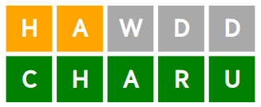
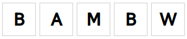
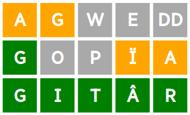

([English text below](#english-text-follows))

# Geiryn: Gêm dyfalu gair Cymraeg

- Dos i [geiryn.com](http://geiryn.com) i chwarae.
- Neu agor `game/index.html` mewn porwr gwe i ddatblygu'n lleol.
- Mae'r cod i gyd yn rhedeg yn y porwr. Does dim cydran gweinydd!

# Sut i chwarae

Dyfala air Cymraeg pump llythyren, er enghraifft:

- Mae'r **R** werdd yn golygu bod yr ateb yn cynnwys **R** yn yr un safle.
- Mae'r **A** a **T** oren yn golygu bod yr ateb yn cynnwys **A** a **T**, ond ddim yn yr un safle.
- Mae'r **TH** a **E** llwyd yn golygu nad yw'r ateb yn cynnwys **TH** neu **E** o gwbl.

Caria ymlaen yn dyfalu geiriau, er enghraifft:

Nawr mae **T** a **R** yn y lle cywir, ac mae **A** yn y lle anghywir.

Cywir! Mae pob un llythyren yn gywir.

# Cwestiynau cyffredin

## Beth os dwi angen dyfalu mwy na chwe gwaith?

Wrth chwarae Geiryn, rwyt ti'n gallu dyfalu cymaint ag sydd angen. Ond rwyt ti'n gallu herio dy hun i ddefnyddio cyn lleied o ddyfaliadau â phosib, os wyt ti eisiau.

Mae gemau eraill o'r fath fel arfer dim ond yn gadael i ti ddyfalu chwe gwaith. Ond dwi wedi penderfynu byddai'n well gadael i bobl ddefnyddio faint bynnag o ddyfaliadau ag sydd angen, oherwydd y ganran uchel o ddysgwyr Cymraeg.

Mae hyn hefyd yn cael gwared â'r syniad o "fethu", sy'n gwneud y gêm yn fwy positif.

## Pam trin llythrennau dwbl yn arbennig? Fyddai'n symlach i gael un blwch i bob nod!

Byddai, symlach i'w godio, ond ddim i'w chwarae. Yn Gymraeg, dydy llythrennau dwbl ddim yn cynnwys ei nodau bysellfwrdd. Er enghraifft, Dydy'r llythyren **LL** ddim yn cynnwys y llythyren **L**, a dydy'r llythyren **CH** ddim yn cynnwys y llythyren **C** na'r llythyren **H**.

Byddai cael gwared ar y syniad o lythrennau dwbl yn gorfodi i bobl feddwl mewn ffordd anghymreigaidd. Er enghraifft:

Dydy hyn ddim yn ffitio'r ffordd mae pobl yn meddwl amdan sillafu Cymraeg: mae **CH** yn llythyren wahanol i **C** neu **H**.

## Sut dwi'n teipio acen, fel â neu ï ?

Mae acenion yn cael ei gynnwys yn awtomatig.

Er enghraifft: os wyt ti'n teipio

(bambŵ ond heb acen) bydd o'n ymddangos fel

Yn yr enghraifft hon, mae'r **Ŵ** yn **BAMBŴ** wedi troi yn wyrdd, oherwydd mae'n troi allan bod yr ateb yn cynnwys **W** fel y llythyren olaf:

Byddai'r fysell **W** ar y bysellfwrdd wedi troi yn wyrdd hefyd. Hynny yw, rwyt ti'n dyfalu **W** ac **Ŵ** ar yr un pryd.

Enghraifft arall: os mai **CYTÛN** yw’r ateb, ac rwyt ti'n dyfalu **UNDEB**, wedyn bydd yr **U** yn troi'n oren.

Ffordd arall o ddweud hyn yw bod y gêm yn acennu / dadacennu geiriau yn awtomatig i ti.

## Pam lai gorfodi i bobl roi acenion â llaw?

Dwi'n meddwl bod hi'n well bod y gêm yn eu rhoi nhw'n awtomatig. Mae llawer o bobl wedi arfer teipio Cymraeg anffurfiol heb acenion. Dydy rhai o'r bobl yma ddim yn deall acennu mor dda, felly bydd y gêm yn llai rhwystredig iddyn nhw os ydy hi'n derbyn eu hatebion. Ond mae hefyd yn dysgu nhw amdan acenion, mewn ffordd hwyl.

Ffactor arall yw'r strategaeth boblogaidd o ddyfalu'r llafariaid yn gynnar. Yn Saesneg mae yna chwe llafariad **AEIOU**(**Y**), felly mae modd dyfalu **WEARY** a **PIOUS** (neu eiriau eraill) i'w profi i gyd mewn dau ddyfaliad.

Beth am yn Gymraeg? Gallwn ni ddyfalu **DELIO** a **LLWYAU** i brofi'r saith llafariad **AEIOUWY**. Ond ai dyna'r holl lafariaid? Beth am **ÂÊÎÔÛŴŶ**? Hefyd **ÄËÏÖÜẄŸ**, **ÁÉÍÓÚẂÝ** a **ÀÈÌÒÙẀỲ**. Os ydyn ni'n cyfrif y rhain fel llythrennau ar wahân, wedyn bydd yna 7 × 5 = 35 llafariaid yn yr iaith(!), llawer ohonyn nhw'n brin iawn, iawn. Yn fy marn i, mae hynny yn gwneud y gêm yn llai hwyl. Byddai hi'n amhosib profi'r holl lafariaid acennog mewn chwe dyfaliad!

## Oes modd dyfalu geiriau treigledig fel "gathod"? Oes modd dyfalu ffurfiau berfol fel "cafodd"?

Oes, mae'n bosib eu dyfalu nhw. Ond nid ydyn nhw'n gallu bod yr ateb. Serch hynny, gallai eu dyfalu nhw fod yn help mawr wrth geisio profi llythrennau penodol. Er enghraifft:

## Ai dyma'r gêm gyntaf o'i fath mewn Cymraeg?

Na: hyd y gwn i, yr un gyntaf oedd [Gairglo](https://www.hiriaith.cymru/gairglo).
Dyma fy mhrif ysbrydoliaeth, ynghyd â'r gêm Saesneg wreiddiol, Wordle.

Dwi wedi creu’r fersiwn yma i ymarfer codio, a hefyd i arbrofi â newid y rheolau ychydig (gweler uchod!)

# Trwydded

Hawlfraint © 2022, menzy314.

Mae'r rhaglen hon yn feddalwedd rhydd; gallwch ei hailddosbarthu a/neu
ei haddasu dan delerau trwydded MIT. Mae'r rhaglen hon yn cael ei dosbarthu yn y gobaith y bydd yn ddefnyddiol, ond HEB UNRHYW WARANT; heb hyd yn oed y warant oblygedig o FARSIANDWYAETH neu FFITRWYDD AT BWRPAS ARBENNIG. Gweler [y drwydded](LICENSE.txt) am ragor o fanylion.

# Diolchiadau
Uned Technolegau Iaith, Prifysgol Bangor, am ddarparu [Lecsicon Cymraeg Bangor](https://github.com/techiaith/lecsicon-cymraeg-bangor).
Mae Geiryn yn cynnwys data o'r lecsicon.

# English text follows

# Geiryn: Welsh word guessing game

- Go to [geiryn.com](http://geiryn.com) to play.
- Or open `game/index.html` in a web browser to develop locally.
- All the code runs in the browser. There is no server component!

# How to play

Guess a five letter Welsh word, for example:

- The green **R** means that the answer contains **R** in the same position.
- The orange **A** and **T** means that the answer contains **A** and **T**, but not in the same position.
- The grey **TH** and **E** means that the answer does not contain **TH** or **E** at all.

Keep guessing words, for example:

Now **T** and **R** are in the right place, and **A** is in the wrong place.

Correct! All letters are correct.

# Frequently asked questions

## What if I need to guess more than six times?

When playing Geiryn, you can guess as much as you need. But you can challenge yourself to use as few guesses as possible, if you want.

Other similar games usually only let you guess six times. But I've decided it would be better to let people use as many guesses as they need, because of the high percentage of Welsh learners.

This also removes the idea of ​​"losing", which makes the game more positive.

## Why treat double letters specially? It would be simpler to have one box for each character!

Yes, simpler to code, but not to play. In Welsh, double letters do not include their keyboard characters. For example, The letter **LL** does not contain the letter **L**, and the letter **CH** does not contain the letter **C** or the letter **H**.

Getting rid of the idea of ​​double letters would force people to think in a non-Welsh way. For example:

This does not fit the way people think about Welsh spelling: **CH** is a different letter to **C** or **H**.

## How do I type an accent, like â or ï ?

Accents are included automatically.

For example: if you type

(bambŵ but without the accent) it will appear as

In this example, the **Ŵ** in **BAMBŴ** has turned green, because it turns out that the answer contains **W** as the last letter:

The **W** key on the keyboard would also have turned green. That is, you guess **W** and **Ŵ** at the same time.

Another example: if the answer is **CYTÛN**, and you guess **UNDEB**, then the **U** will turn orange.

Another way of saying this is that the game automatically accents / de-accents words for you.

## Why not force people to add accents manually?

I think it's better that the game places them automatically. Many people are used to typing informal Welsh without accents. Some of these people don't understand accents that well, so the game will be less frustrating for them if it accepts their answers. But it also teaches them about accents, in a fun way.

Another factor is the popular strategy of guessing the vowels early. In English there are six vowels **AEIOU**(**Y**), so it is possible to guess **WEARY** and **PIOUS** (or other words) to test them all in two guesses.

How about in Welsh? We can guess **DELIO** and **LLWYAU** to test the seven vowels **AEIOUWY**. But is that all the vowels? How about **ÂÊÎÔÛŴŶ**? Also **ÄËÏÖÜẄŸ**, **ÁÉÍÓÚẂÝ** and **ÀÈÌÒÙẀỲ**. If we count these as separate letters, then there will be 7 × 5 = 35 vowels in the language(!), many of them very, very rare. In my opinion, that makes the game less fun. It would be impossible to test all the accented vowels in six guesses!

## Is it possible to guess mutated words like "gathod"? Is it possible to guess verb forms like "cafodd"?

Yes, it is possible to guess them. But they can't be the answer. However, guessing them could be of great help when trying to test certain letters. For example:

## Is this the first game of its kind in Welsh?

No: to my knowledge the first one was [Gairglo](https://www.hiriaith.cymru/gairglo).
This is my main inspiration, along with the original English game, Wordle.

I've created this version to practice coding, and also to experiment with changing the rules a little (see above!)

# Licence

Copyright © 2022, menzy314.

This program is free software; you can redistribute and/or modify it under the terms of the MIT licence. This program is distributed in the hope that it will be useful, but WITHOUT ANY WARRANTY; without even the implied warranty of MERCHANTABILITY or FITNESS FOR A PARTICULAR PURPOSE. See [the licence](LICENSE.txt) for more details.

# Acknowledgments
Language Technologies Unit, Bangor University, for providing [Lecsicon Cymraeg Bangor](https://github.com/techiaith/lecsicon-cymraeg-bangor). Geiryn contains data from the lexicon.
